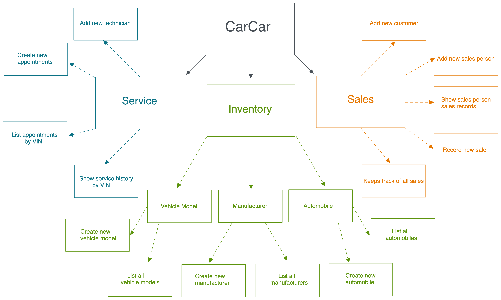
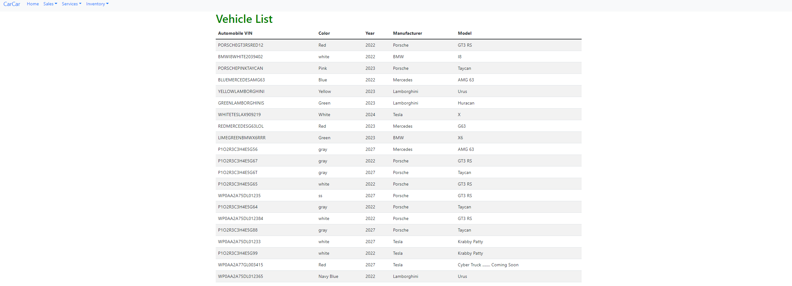
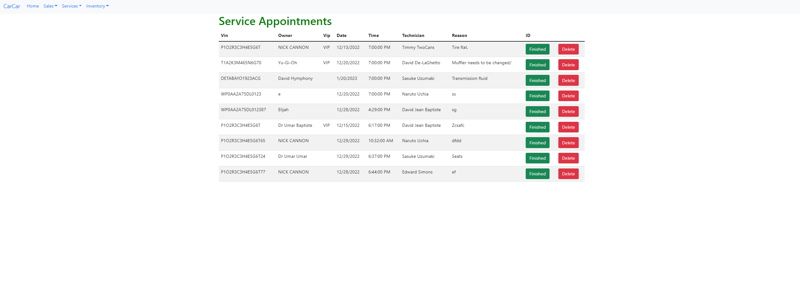
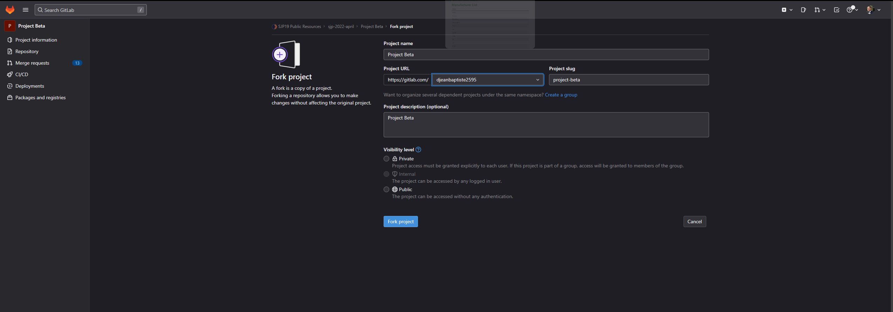
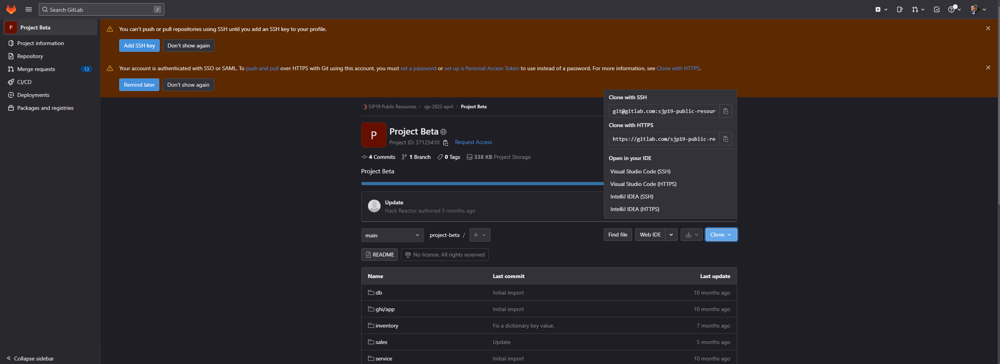
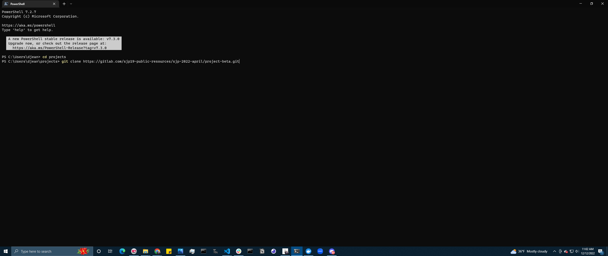

### Team:

* David Jean Baptiste- Service microservice
* Jackie Lee - Sales microservice

# Design
This project consists of 3 microservices (Inventory, Sales, Service) operating within their own bounded contexts. There is an integration point between the Service and Sales microservices with the Inventory microservice through the automobile model. The Sales and Service microservices have an automobile value object model. The microservices integrate with the inventory system via polling. The poller periodically checks the automobiles in inventory and compares them to the automobile value object in both microservices. If there are any discrepancies, it updates the microservices accordingly. The models, views, and data that comprise the backend are used to build and populate the frontend. When a user opens the site, they'll be able to use the navbar to check out different components.




### Inventory<br>
- With CarCar you can store all of your vehicles in one place!(and no there is not an overnight storage fee!) <br> Keep vins, makes, models, images, colors and the year of each vehicle together so you no longer need to sift through reams of paper.



### Services<br>
- Have a mechanic business too?<br>
CarCar will help you manage technicians, times of service, and services performed. This will be stored along side the cars information and the customer who brought it in. We know its a VIP if the car was in our inventory before.


# How to run the app
1. Fork this repository from git lab https://gitlab.com/jlee428/project-beta
2. Change the project name and the project slug, if desired. For the project URL, choose the correct namespace. Include a project description if you want, and choose the desired visibility level.



<p>&nbsp;</p>

3. Next, clone the repo. To do this, click the __clone__ button and copy the HTTPS link to your clipboard.



<p>&nbsp;</p>

4. In your terminal, `cd` into the directory that you wish to store the project. Clone the repository by typing `git clone` followed by the copied gitlab link.



<p>&nbsp;</p>

5. After cloning the repo, `cd` into the project folder. Make sure the docker dashboard is running. Run the following commands one by one in your terminal to build and run the application.
```
docker volume create beta-data
docker-compose build
docker-compose up
```
6. Once you run these commands, you can open the application in VS Code by typing the terminal command `code .`.
7. Once your docker is running go to http://localhost:3000 to see the website and you can utilize the navigation through the links on top of the page.

<p>&nbsp;</p>

## Sales microservice
The sales microservice is divided into 2 portions. The first is the backend APIs, and the second is the frontend built with React. This service allows you to create and view customers, salespersons, and sales records.

Below are the RESTful APIs that the main project can hit to gather the data for the frontend. From Insomnia and your browser, you can access the sales endpoints at the following URLs.

### Customer API
| Action    | Method  | URL                             |
|-----------|---------|---------------------------------|
| List Customers| GET     | http://localhost:8090/api/customers |
| Create Customer| POST     | http://localhost:8090/api/customers |
| Customer detail| GET     | http://localhost:8090/api/customers/:id/ |
| Update Customer| PUT     | http://localhost:8090/api/customers/:id/ |
| Delete Customer| DELETE     | http://localhost:8090/api/customers/:id/ |

\* Replace the `:id` in the url with the corresponding integer of the id of that customer.

#### Example of creating a customer using the POST method
Put this in the body of Insomnia as JSON:
```
{
	"name" : "Michael Jackson",
	"address" : "12 uphill ave, why, ca",
	"phone_number" : "900-100-2001"
}
```
Updating a customer:

#### Expected response data for each route:
##### GET List of Customers
```
{
	"customers": [
		{
			"name": "Yu-gi-oh",
			"address": "12 uphill ave, why, ca",
			"phone_number": "900-100-2001",
			"id": 1
		},
		{
			"name": "Goku",
			"address": "123 Wonder st, Sf, Ca",
			"phone_number": "12345678910",
			"id": 3
		}
	]
}
```
##### POST Customer, GET Customer Details, PUT (Update) Customer Details
Success, __Status 200 OK__:
```
{
	"name" : "Michael Jackson",
	"address" : "12 uphill ave, why, ca",
	"phone_number" : "900-100-2001"
}

##### DELETE Customer
Success, __Status 200 OK__:

{
	"deleted": "true"
}
```


### Salesperson API

| Action     | Method | URL                                         |
|------------|--------|---------------------------------------------|
| List Sales | GET    | http://localhost:8090/api/sales/person      |
| Create Sale| POST   | http://localhost:8090/api/sales/person      |
| Sale detail| GET    | http://localhost:8090/api/sales/person/:id/ |
| Update sale| PUT    | http://localhost:8090/api/sales/person/:id/ |
| Delete sale| DELETE | http://localhost:8090/api/sales/person/:id/ |

\* Replace the `:id` in the url with the corresponding integer of the id of that salesperson.

Example of creating a sales person
```
{
    "name" : "Timothy de'Laghetto",
	"employee_number" : "777"
}
```

### Sales API

| Action     | Method  | URL                                  |
|------------|---------|--------------------------------------|
| List Sales | GET     | http://localhost:8090/api/sales      |
| Create Sale| POST    | http://localhost:8090/api/sales      |
| Sale detail| GET     | http://localhost:8090/api/sales/:id/ |
| Update sale| PUT     | http://localhost:8090/api/sales/:id/ |
| Delete sale| DELETE  | http://localhost:8090/api/sales/:id/ |

\* Replace the `:id` in the url with the corresponding integer of the id of that sale.

Creating and updating a sale requires automobile vin, sales_person id, or customer id.
```
{
    "price" : 1000,
	"automobile" : "1C3CC5FB2AN120174",
	"sales_person" : 1,
	"customer" : 1
}
```


### Approach for sales microservice

- Django is used to build the backend model, views and urls for sales microservice
- settings - Linked the django app and project and cors
- Models consist of AutomobileVO, SalesPerson, Customer, SalesRecord
- Registered models in the admin.py
- Views utilized restful api (POST, GET, DELETE, PUT)
- URLS linking paths from both the app and project
- Ensured the correct polling of data

<p>&nbsp;</p>

## Service microservice
The service microservice is responsible for handling and keeping track of service appointments. The service allows you to create technicians and service appointments, and view lists of unfinished appointments and the appointment history for specific automobiles via their VIN number.

Below are the RESTful APIs that the main project can hit to gather the data for the frontend. From Insomnia and your browser, you can access the service endpoints at the following URLs.


### Technician API
| Action            | Method | URL                                       |
|-------------------|--------|-------------------------------------------|
| List Technician   | GET    | http://localhost:8080/api/technicians/    |
| Create Technician | POST   | http://localhost:8080/api/technicians/    |
| Technician Details| GET    | http://localhost:8080/api/technicians/:id/|
| Update Technician | PUT    | http://localhost:8080/api/technicians/:id/|
| Delete Technician | DELETE | http://localhost:8080/api/technicians/:id/|

\* Replace the `:id` in the url with the corresponding integer of the id of that technician.

#### Example of creating a technician using the POST method
Put this in the body of Insomnia as JSON:
```
{
	"name": "David Jenna Bartiste",
	"employee_number": 7140
}
```
Updating a technician can take the name or the id of the technician.

#### Expected response data for each route:
##### GET List of Technicians
```
{
	"technicians": [
		{
			"name": "Clark Kent",
			"employee_number": 7728,
			"id": 1
		},
		{
			"name": "David Jenna Bartiste",
			"employee_number": 7140,
			"id": 2
		}
	]
}
```
##### POST Technician, GET Technician Details, PUT (Update) Technician Details
Success, __Status 200 OK__:
```
{
	"name": "David Jenna Bartiste",
	"employee_number": 7140,
	"id": 2
}
```
Failure (if the id in the url does not exist in the database), __Status 404 Not Found__:
```
{
	"message": "Technician does not exist"
}
```
##### DELETE Technician
Success, __Status 200 OK__:
```
{
	"message": "Technician has been deleted"
}
```
Failure (if the id in the url does not exist in the database), __Status 404 Not Found__:
```
{
	"message": "Technician does not exist"
}
```

### Service Appointment API

| Action              | Method | URL                             |
|---------------------|--------|---------------------------------|
| List Appointments   | GET    | http://localhost:8080/api/appointments/ |
| Create Appointment  | POST   | http://localhost:8080/api/appointments/ |
| Appointment Details | GET    | http://localhost:8080/api/appointments/:id/ |
| Update appointment  | PUT    | http://localhost:8080/api/appointments/:id/ |
| Delete appointment  | DELETE | http://localhost:8080/api/appointments/:id/ |

\* Replace the `:id` in the url with the corresponding integer of the id of that appointment.

#### Example of creating an appointment using the POST method
```
{
	"vin": "1LNLM82W1RY783342",
	"owner": "Black Panther",
	"date": "2022-10-26",
	"time": "13:00:00",
	"technician": 1,
	"reason": "check engine light"
}
```
Updating an appointment can take a change to any of the above fields.

#### Expected response data for each route:
##### GET List of Appointments
```
{
	"appointments": [
		{
			"vin": "3VWPL8AJ9AM630526",
			"owner": "Charles Barkley",
			"date": "2022-10-25",
			"time": "14:00:00",
			"technician": {
				"name": "Denise Dean",
				"employee_number": 7140,
				"id": 1
			},
			"reason": "Oil Change",
			"vip": false,
			"active": true,
			"id": 2
		},
		{
			"vin": "3VWPL8AJ9AM630526",
			"owner": "Charles Barkley",
			"date": "2022-10-26",
			"time": "09:00:00",
			"technician": {
				"name": "Einar Reinertsen",
				"employee_number": 2686,
				"id": 2
			},
			"reason": "AC Broken",
			"vip": false,
			"active": true,
			"id": 4
		},
	]
}
```
##### POST Appointment, GET Appointment Details, PUT (Update) Appointment Details
Success, __Status 200 OK__:
```
{
	"vin": "1LNLM82W1RY783342",
	"owner": "Charles Barkley",
	"date": "2022-10-26",
	"time": "13:00:00",
	"technician": {
		"name": "Denise Dean",
		"employee_number": 7140,
		"id": 1
	},
	"reason": "funny noise",
	"is_vip": true,
	"is_finished": false,
	"id": 7
}
```
Failure (if the id in the url does not exist in the database), __Status 404 Not Found__:
```
{
	"message": "Appointment does not exist"
}
```
##### DELETE Appointment
Success, __Status 200 OK__:
```
{
	"message": "Appointment has been deleted"
}
```
Failure (if the id in the url does not exist in the database), __Status 404 Not Found__:
```
{
	"message": "Appointment does not exist"
}
```
<p>&nbsp;</p>

# Application UI
The following tables show the URL paths for each microservice. Each page can be reached by typing `localhost:3000` followed by the path.

## Inventory
In the inventory microservice, you can get a list of manufacturers, vehicle models, and automobiles in inventory. You can also add new manufacturers, vehicle models, and automobiles.


| Method | Path | Description |
| ------ | --------------------- | --------------------------------------------- |
| GET    | `/manufacturers` | Get a list of manufacturers records|
| POST   | `/manufacturers/new` | Add a new manufacturer record |
| GET    | `/models` | Get a list of vehicle models |
| POST   | `/models/new` | Add a new vehicle model |
| GET    | `/automobiles` | Get a list of automobiles in inventory |
| POST   | `/automobiles/new` | Add a new automobile to inventory |

## Sales
In the sales microservice, you can get a list of sales records and a list of an individual salesperson's sales history. You can also create a sales record, register a new salesperson, and register a new customer.


| Method | Path | Description |
| ------ | --------------------- | --------------------------------------------- |
| GET    | `/salesrecords` | Get a list of sales records |
| POST   | `/salesrecords/new` | Create a new sales record |
| GET    | `/salesperson/history` | Filter the sales history of a salesperson |
| POST   | `/salesperson/new`| Register a new salesperson |
| POST   | `/customers/new` | Register a new customer |

## Service
In the service microservice, you can register a new technician and create a new service appointment. You can also get a list of unfinished service appointments, and the service appointment history for a particular VIN number.

| Method |         Path       | Description     |
| ------ | -------------------| ----------------|
| POST   | `/technicians/new` | Register a new technician|
| POST   | `/appointments/new` | Create a new sales record |
| GET    | `/appointments` | Get a list of appointments |
| GET    | `/appointments/history` | Get the service appointment history for a particular VIN|

<p>&nbsp;</p>

# Value Objects
    RESTful autmobileVO views with urls
1. automobile_vo_list are functions for:
- GET-  get the list of automobiles http://localhost:8080/api/automobileVO/
2. auto_vo_delete functions for:
- DELETE-  Delete a automobuiles http://localhost:8080/api/automobileVO/<int:pk>/


# Important git commands
## Merging Branches to Main

```
(my-branch) $ git checkout main    # switch to main branch
(main) $ git pull                  # get latest from remote
(main) $ git checkout my-branch    # switch to dev branch
(my-branch) $ git merge main       # merge latest into dev branch
... handle any merging here
... test out your code
(my-branch) $ git checkout main    # switch to main branch
(main) $ git pull                  # test for changes on remote
... if no changes proceed,
... if changes go back to line 3
(main) $ git merge my-branch       # merge dev branch into main
(main) $ git push                  # push changes to the remote
(main) $ git checkout my-branch    # change back to dev branch
                                   # now do more work
```
